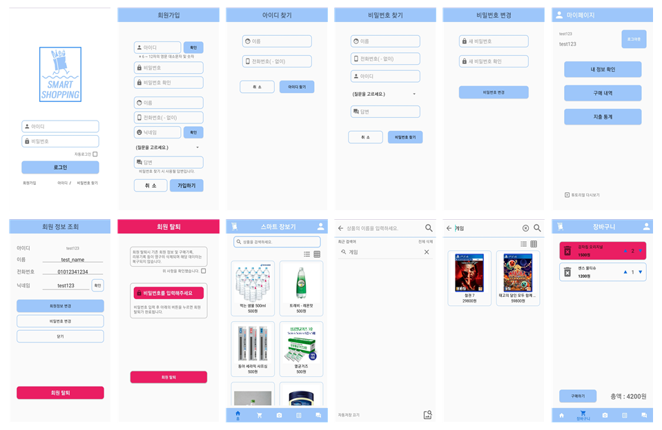
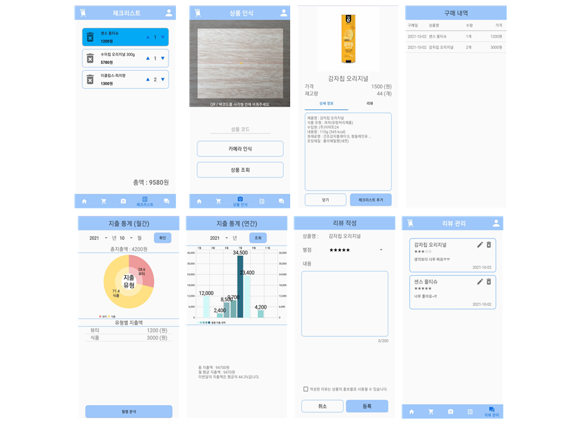

# 스마트 장보기

## 개요

## 주요 기능

<table>
    <tr>
        <th>기능</th>
        <th>상세 기능</th>
        <th>세부 설명</th>
    </tr>
    <tr>
        <td rowspan="3">상품 인식</td>
        <td>카메라 인식</td>
        <td>내용</td>
    </tr>
    <tr>
        <td>바코드 인식</td>
        <td>내용</td>
    </tr>
    <tr>
        <td>QR코드 인식</td>
        <td>내용</td>
    </tr>
    <tr>
        <td rowspan="2">상품 조회</td>
        <td>상품 검색</td>
        <td>내용</td>
    </tr>
    <tr>
        <td>상품 정보 조회</td>
        <td>내용</td>
    </tr>
    <tr>
        <td rowspan="4">체크리스트</td>
        <td>리스트 작성</td>
        <td>내용</td>
    </tr>
    <tr>
        <td>리스트 삭제</td>
        <td>내용</td>
    </tr>
    <tr>
        <td>리스트 총액 계산</td>
        <td>내용</td>
    </tr>
    <tr>
        <td>리스트 확인</td>
        <td>내용</td>
    </tr>
    <tr>
        <td rowspan="4">장바구니</td>
        <td>장바구니 추가</td>
        <td>내용</td>
    </tr>
    <tr>
        <td>장바구니 삭제</td>
        <td>내용</td>
    </tr>
    <tr>
        <td>장바구니 총액 계산</td>
        <td>내용</td>
    </tr>
    <tr>
        <td>장바구니 확인</td>
        <td>내용</td>
    </tr>
    <tr>
        <td rowspan="4">리뷰 관리</td>
        <td>리뷰 조회</td>
        <td>내용</td>
    </tr>
    <tr>
        <td>리뷰 작성</td>
        <td>내용</td>
    </tr>
    <tr>
        <td>리뷰 삭제</td>
        <td>내용</td>
    </tr>
    <tr>
        <td>리뷰 수정</td>
        <td>내용</td>
    </tr>
    <tr>
        <td rowspan="3">지출 통계</td>
        <td>구매 내역 저장</td>
        <td>내용</td>
    </tr>
    <tr>
        <td>구매 내역 조회</td>
        <td>내용</td>
    </tr>
    <tr>
        <td>지출 분석</td>
        <td>내용</td>
    </tr>

</table>

## 프로젝트 화면 구성

